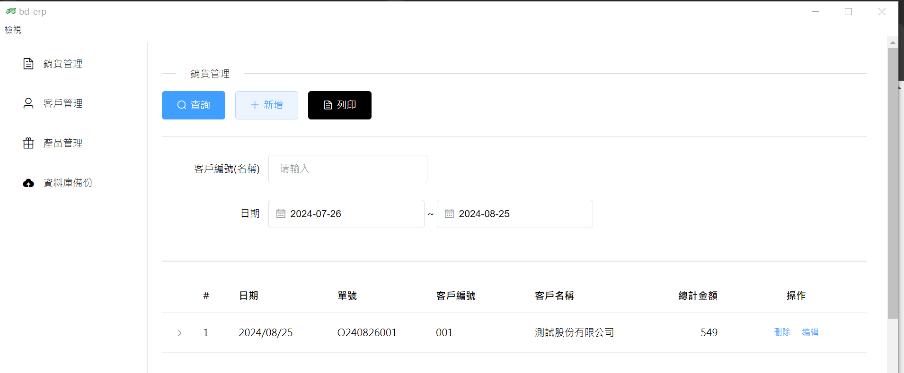
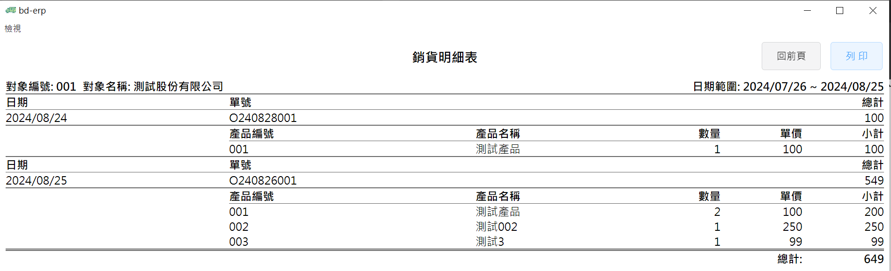
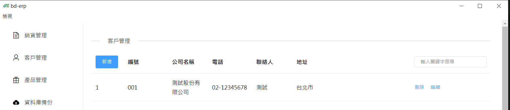
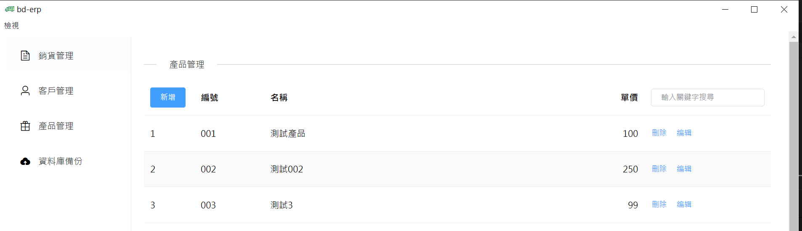
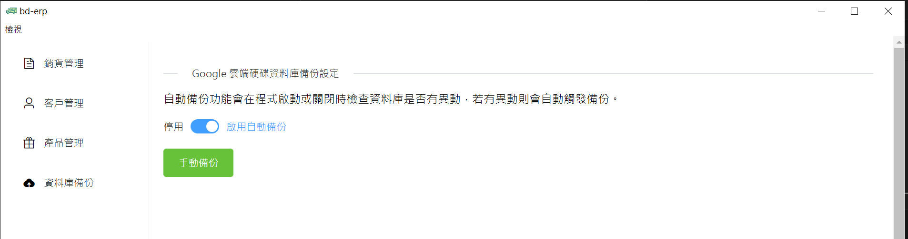

# BdErp - Electron App
BdErp is a very simple Electron-based application that allows users to create customers, products, and sales orders, as well as print sales orders. This app was developed specifically for my family to help manage these tasks more easily.

## Features
### Sales Management

### Sales Details Report

### Customer Management

### Product Management

### Google Drive Database Backup

